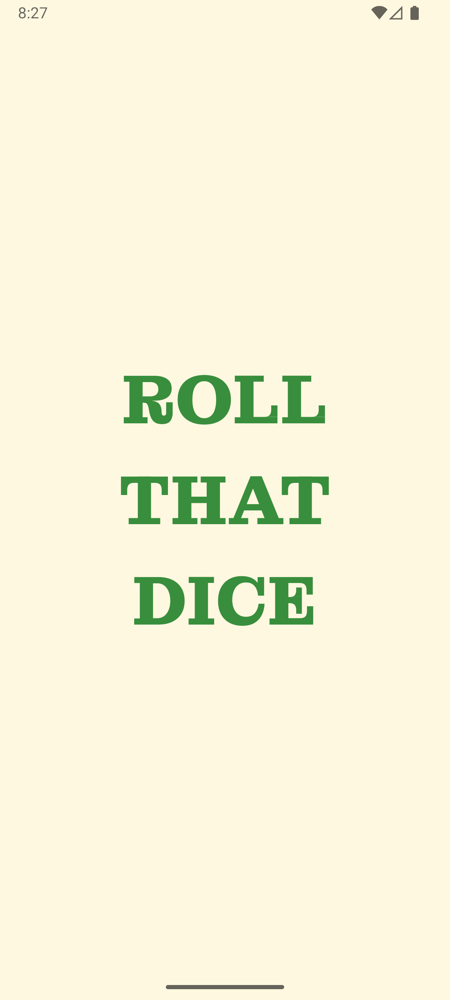
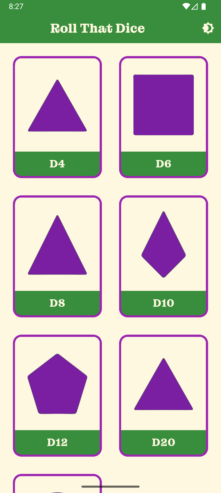
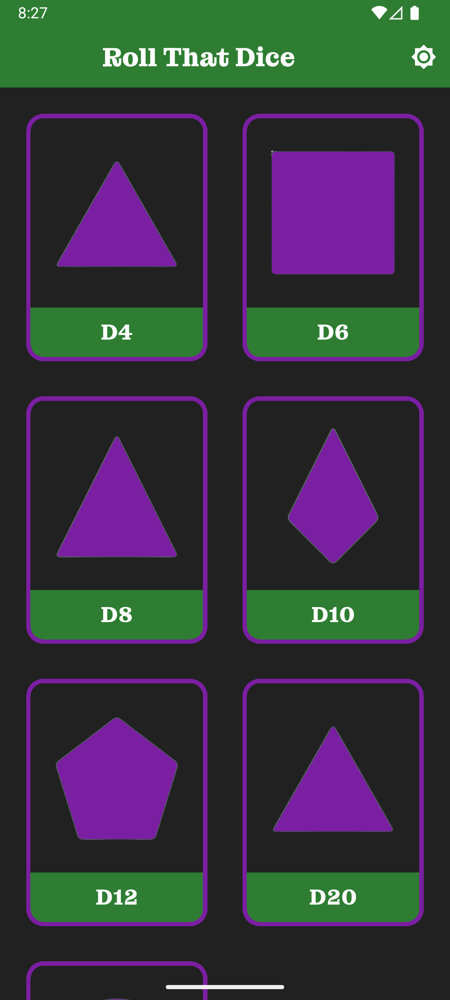
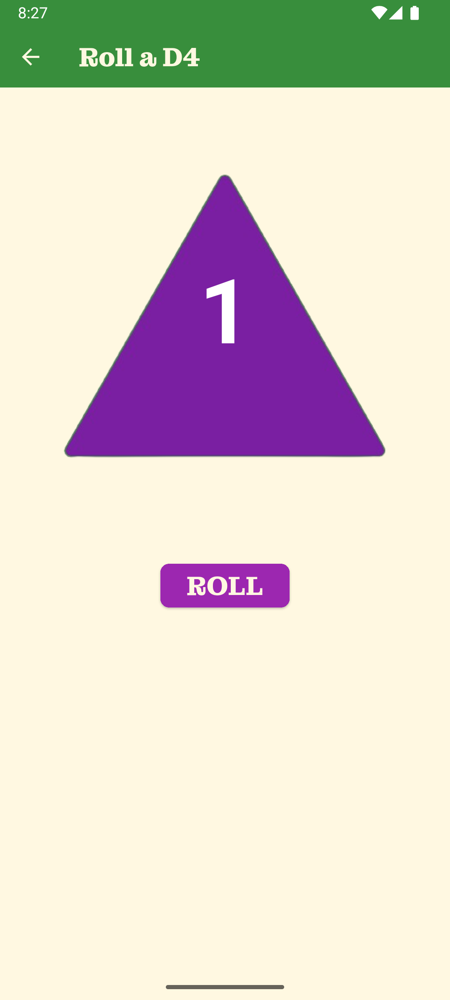
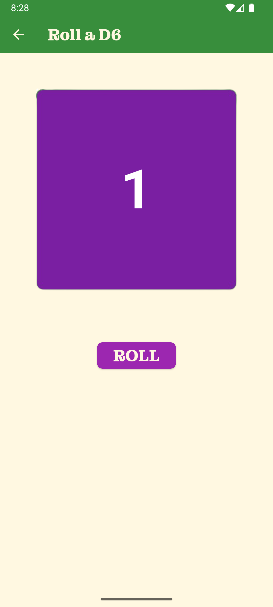
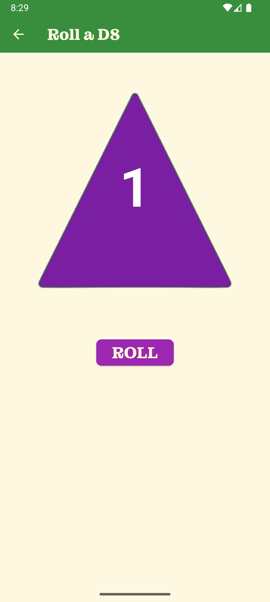
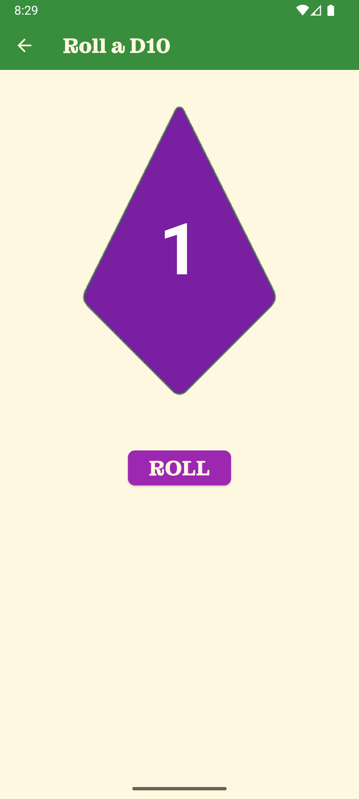
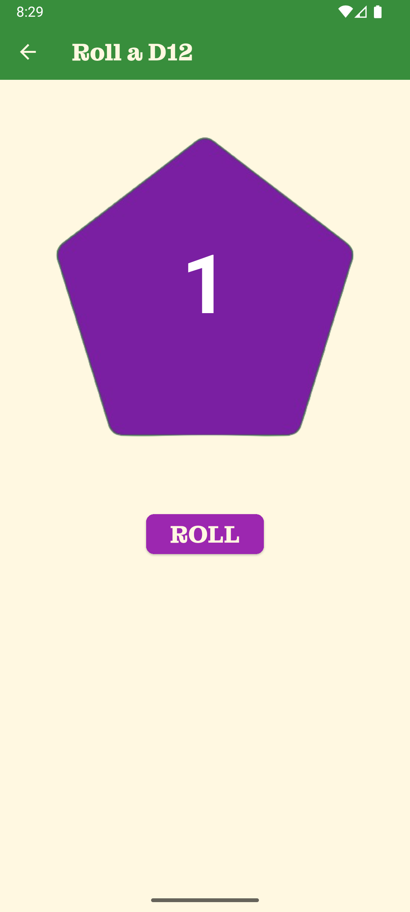
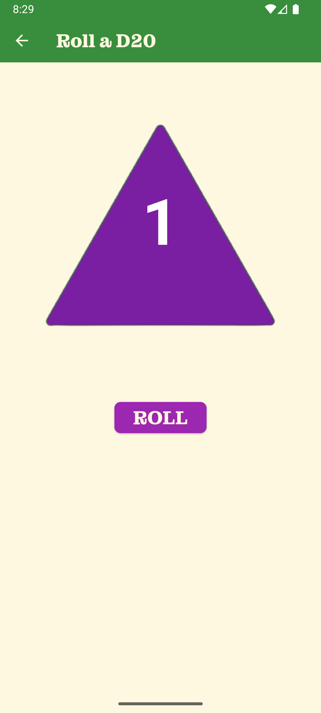
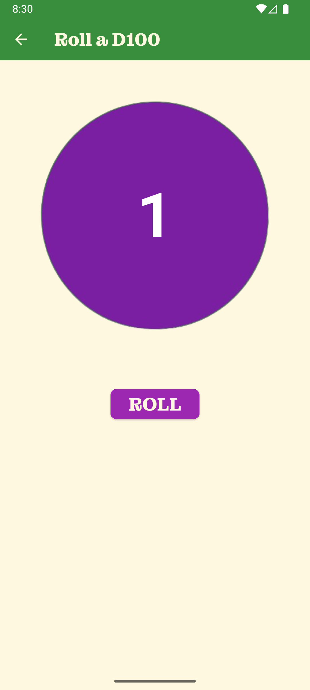

# Roll That Dice

**Roll That Dice** is a Flutter-based application that allows users to simulate rolling different types of dice. Whether you're playing a tabletop game, doing probability exercises, or just having some fun, this app lets you roll dice with a simple tap.

## Features

- **Multiple Dice Types:** Supports a variety of dice, including D4, D6, D8, D10, D12, D20, and D100.
- **Responsive UI:** The app adjusts beautifully across different screen sizes and orientations.
- **Light & Dark Themes:** Switch between light and dark themes to suit your preference.
- **Sound Effects:** Enjoy immersive sound effects when rolling the dice.
- **Splash Screen:** Displays a splash screen with a smooth transition to the main app.
- **Custom Fonts:** Uses the elegant MontaguSlab font for a sophisticated look.

## Screenshots

> Explore the look and feel of **Roll That Dice** across themes and dice types.

### 🚀 App Flow

|                  Splash Screen                  |                   Home (Light)                    |                        Home (Dark)                         |
|:-----------------------------------------------:|:-------------------------------------------------:|:----------------------------------------------------------:|
|  |  |  |

---

### 🎞️ Live Demo

<p align="center">
  
</p>

---

### 🎲 Dice Screens

|                   D4                    |                   D6                    |                   D8                    |                    D10                    |
|:---------------------------------------:|:---------------------------------------:|:---------------------------------------:|:-----------------------------------------:|
|  |  |  |  |

|                    D12                    |                    D20                    |                    D100                     |
|:-----------------------------------------:|:-----------------------------------------:|:-------------------------------------------:|
|  |  |  |

## APK
- [dice_app_v0.1.0-pre.apk](https://github.com/SayvIlahsiav/dice_app/releases/download/v0.1.0-pre/dice_app_v0.1.0-pre.apk)

## Installation

To run this app locally, follow these steps:

1. **Clone the repository:**

   ```bash
   git clone https://github.com/sayvilahsiav/dice-app.git
   cd dice-app
   ```

2. **Install dependencies:**

   ```bash
   flutter pub get
   ```

3. **Run the app:**

   ```bash
   flutter run
   ```

## Usage

### Rolling the Dice:

- Select a die from the home screen by tapping on it.
- Press the "ROLL" button on the dice roll screen to roll the die.

### Switching Themes:

- Toggle between light and dark mode using the icon in the top-right corner of the home screen.

## Code Overview

### Main Components

- `main.dart`: Initializes the app and handles theme management.
- `home_screen.dart`: Displays the grid of dice for selection.
- `dice_roll_screen.dart`: Contains the logic and UI for rolling the dice.
- `theme_provider.dart`: Manages the theme-switching functionality.
- `app_theme.dart`: Defines the light and dark theme data.
- `dice_button.dart`: Custom widget for displaying dice in the grid.
- `dice_data.dart`: Stores each die's attributes (type, image, max number).

### Asset Structure

- **Images:**
  - Dice images are stored in `assets/images/`.
- **Fonts:**
  - Custom font MontaguSlab is located in `assets/fonts/`.

### Themes

- **Light Theme:**
  - Default theme with bright colours and a clean look.
- **Dark Theme:**
  - Provides a darker colour palette, ideal for low-light environments.

## Future Enhancements

- [ ] **Custom Dice Creation:** Allow users to create custom dice with their own number ranges.
- [ ] **Roll History:** Track and display the history of dice rolls.
- [ ] **Enhanced Animations:** Add animations to make the rolling experience more dynamic.
- [ ] **Statistics:** Provide statistics on rolls, such as averages and probabilities.

## Contributing

Contributions are welcome! If you have ideas for improvements or find bugs, please open an issue or submit a pull request.

## Acknowledgments

- Thanks to the Flutter community for their excellent resources and support.
- Special mention to MontaguSlab for the beautiful font used in the app.

Happy Rolling!
